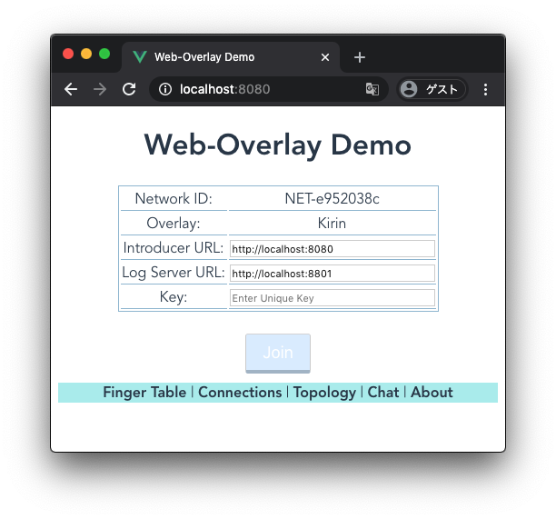
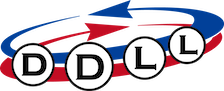

# Table of Contents

{::options parse_block_html="true" /}
<div id="toc">
* [Overview](#overview)
* [License](#license)
* [Repository](#repository)
* [Documentation](#documentation)
* [Build](#build)
* [Play with Demo](#play-with-demo)
  * [Start an initial node](#start-an-initial-node)
  * [Join your Web browser](#join-your-web-browser)
    * [Finger tables](#finger-tables)
    * [Connections](#connections)
    * [Topology](#topology)
    * [Primitive Chat](#primitive-chat)
* [Kirin](#kirin)
* [DDLL](#ddll)
* [References](#references)
* [Acknowledgements](#acknowledgements)
</div>
{::options parse_block_html="false" /}

# Overview

*Web-Overlay* is an experimental toolkit for constructing Web-based
overlay networks, where each node (peer) is either a Web browser or a
Node.js.  WebRTC and WebSocket (actually
[Socket.io](https://socket.io/)) connections are used as an
interconnect between nodes.

Web-Overlay includes implementation of *Connection Manager* and
a structured overlay network, *Kirin*.

Web-Overlay is developed by Abe Lab at Osaka City University, Japan
[[Link](https://www.media.osaka-cu.ac.jp/~k-abe/)].

# License
GNU General Public License 3.0.

# Repository
[https://github.com/abelab/web-overlay](https://github.com/abelab/web-overlay)

# Documentation

Documentations are being prepared.

# Build
You need a Node.js installed on your computer.  (We are using Node.js
v12.16.xx for now.)

Get the source code from github (as this software is not yet exported
as an npm package).

```bash
% git clone https://github.com/abelab/web-overlay.git
```

Install [lerna](https://lerna.js.org/) locally.
```bash
% cd web-overlay
% npm install
```

Fetch dependencies
```bash
% npx lerna bootstrap
```

Transpile from TypeScript
```bash
% npx lerna run build
```

# Play with Demo

In the following setup, all nodes must be on the same host.

## Start an initial node

The initial node (the first node of the overlay network) must be a
Node.js node.

```bash
% cd web-overlay/packages/demo
% env DEPLOYMENT=localhost8080-initial npm run portal
```

This command starts the initial node based on the configuration
`./config/deployment/localhost8080-initial.json`.

Your initial node will start listening on http://localhost:8080.

```
Run as the initial portal node
- NETWORK_ID: NET-b4bbd842
- LOG_SERVER_URL: http://localhost:8801
- OVERLAY: kirin
- MY_URL: http://localhost:8080
- DEBUG: DEBUG:*
- HTTP ROOT: ..../packages/demo/dist
starting portal node...
initInitialNode succeeded
started: NodeId=cc348211, URL=http://localhost:8080
Command list: status, leave, quit, enable, disable
Prompt>
```

## Join your Web browser

Access to http://localhost:8080 with your Web browser.
Enter some key (string) and push Join button.  If everything goes well,
your browser will join the overlay network.
You can join multiple browsers (or multiple windows/tabs) to the network.



There are several links on the cyan stripe.

### Finger tables


### Connections


### Topology


### Primitive Chat


# Kirin
Web-Overlay includes an implementation of *Kirin* structured overlay network.

Kirin is a key-order preserving structured overlay network (KOPSON).
In Kirin, each node has a unique key.  You can send a message to a
node by specifying a key (unicast) and also to a set of nodes by
specifying a key range (multicast or range query).

Kirin is a ring-based overlay network and based on [*Suzaku*
structured overlay network](#suzakuref), which is based on
[*Chord#*](#chordsharpref).

# DDLL



Kirin uses a modified version of [DDLL algorithm](#ddllref) for managing
distributed doubly-linked ring structure.  DDLL supports node
insertion, deletion, and failure recovery.  This DDLL implementation is
also included in Web-Overlay.

# References
<dl>
<dt id="suzakuref">Suzaku</dt>
<dd>Kota Abe and Yuuichi Teranishi: "Suzaku: A Churn Resilient and
Lookup-Efficient Key-Order Preserving Structured Overlay Network",
IEICE Transactions on Communications, Vol. E102–B, No. 9,
pp. 1885-1894, 2019.
<a href="https://search.ieice.org/bin/summary.php?id=e102-b_9_1885&category=B&year=2019&lang=E">[Link1]</a>
<a href="https://dlisv03.media.osaka-cu.ac.jp/il/meta_pub/G0000438repository_07451345-e102.b-9-1885">[Link2]</a>
</dd>
<dt id="chordsharpref">Chord#</dt>
<dd>Thorsten Schütt, Florian Schintke and Alexander Reinefeld:
"Range queries on structured overlay networks",
Computer Communications, Vol. 31, No. 2, pp.358-374, 2008.
<a href="https://www.sciencedirect.com/science/article/abs/pii/S0140366407003258">[Link]</a>
</dd>
<dt id="ddllref">DDLL</dt>
<dd>Kota Abe and Mikio Yoshida: "Constructing Distributed Doubly
Linked Lists without Distributed Locking", In Proceeding of the IEEE
International Conference on Peer-to-Peer Computing 2015 (P2P 2015), 2015.
<a href="https://ieeexplore.ieee.org/document/7328521">[Link1]</a>
<a href="http://www.media.osaka-cu.ac.jp/~k-abe/research/Constructing_Distributed_Doubly_Linked_Lists_without_Distributed_Locking.html">[Link2]</a>
</dd>
</dl>

# Acknowledgements
This work was supported by JSPS KAKENHI Grant Number 16K00135.

<div style="text-align: right;">
Last updated: Fri Jun 12 13:18:15 JST 2020
</div>

<!-- Local Variables: -->
<!-- coding: utf-8 -->
