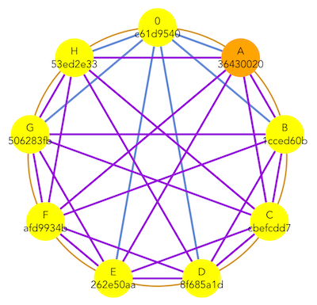
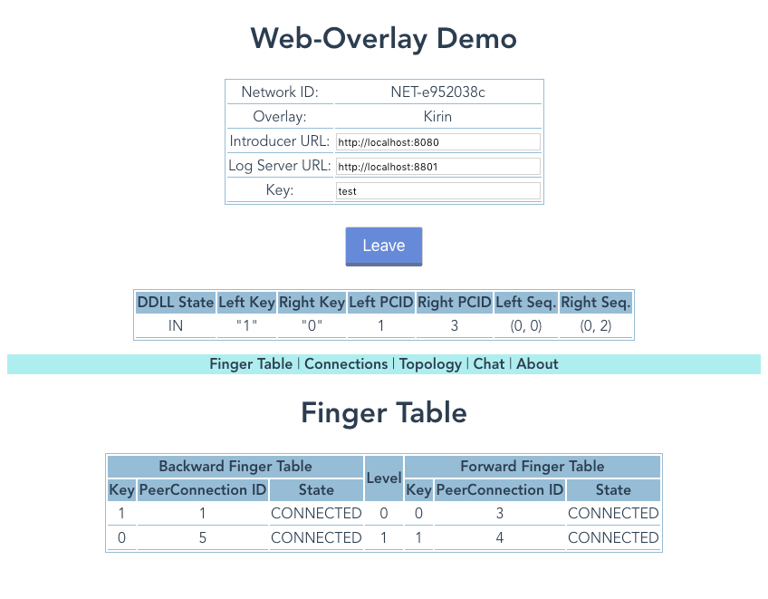
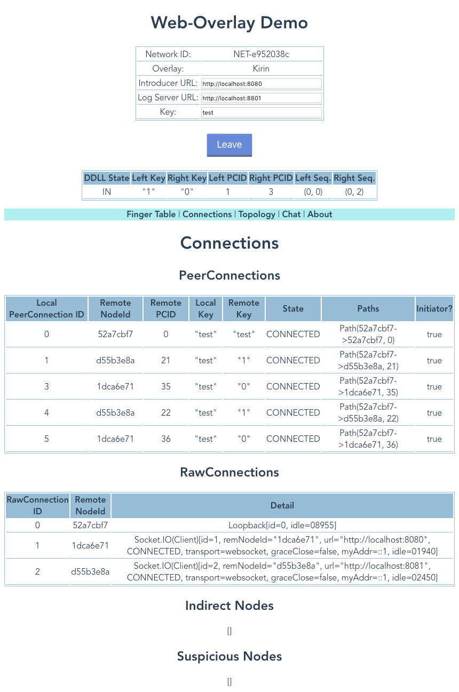
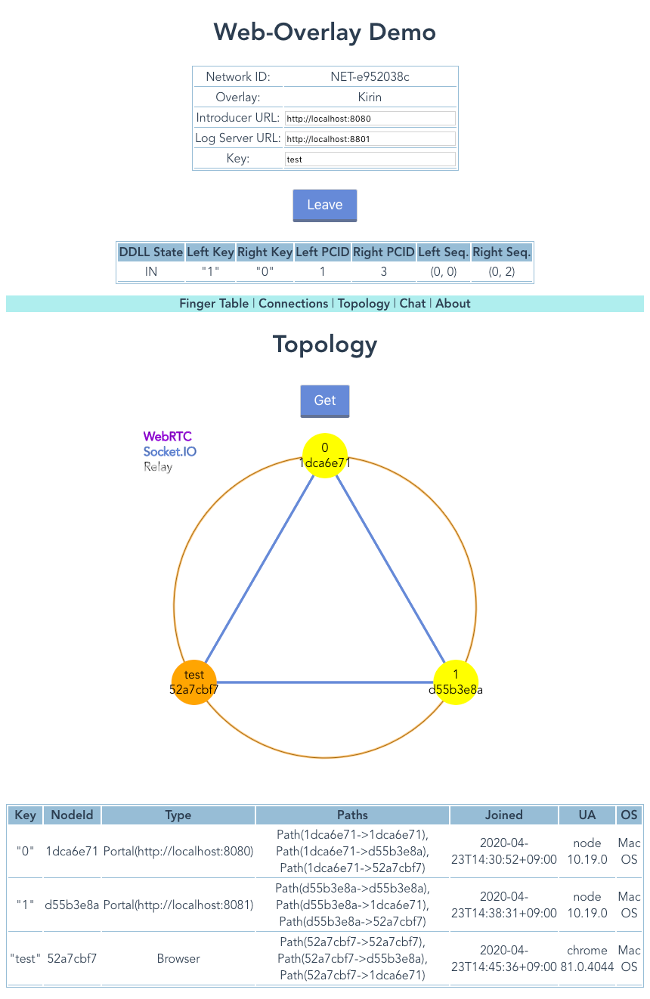
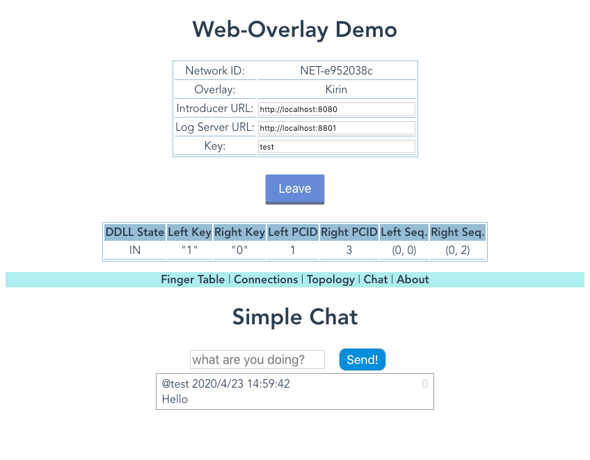

# Web-Overlay



Table of Contents
=================

* [Overview](#overview)
* [Build](#build)
* [Documents](#documents)
* [Play with Demo](#play-with-demo)
  * [Start an initial node](#start-an-initial-node)
  * [Join your Web browser](#join-your-web-browser)
* [Screenshots](#screenshots)
  * [Finger tables](#finger-tables)
  * [Connections](#connections)
  * [Topology](#topology)
  * [Primitive Chat](#primitive-chat)
* [Kirin](#kirin)
* [DDLL](#ddll)
* [References](#references)
* [License](#license)
* [Acknowledgements](#acknowledgements)
  
## Overview
*Web-Overlay* is a software for Web-based overlay network,
where each node (peer) is either a Web browser or a Node.js.
WebRTC and WebSocket (actually [Socket.io](https://socket.io/)) connections are used for interconnect.   
  
Web-Overlay includes a connection manager and structured overlay network, *Kirin*.

Web-Overlay is developed by Kota Abe's research group at Osaka City University
[[Link](https://www.media.osaka-cu.ac.jp/~k-abe/)].

This software is quite experimental and not for production use.

## License
GNU General Public License 3.0.

## Build
You need a Node.js installed on your computer.  

Get the source code (This software is not yet exported as a npm package).

```
git clone https://github.com/abelab/web-overlay.git
```

Install [lerna](https://lerna.js.org/) locally. 
```
cd web-overlay
npm install
```

Fetch dependencies
```
npx lerna bootstrap
```

Transpile from TypeScript
```
npx lerna run build
```

## Documents

Not yet available!

## Play with Demo

In the following setup, all nodes must be on the same host.

### Start an initial node

Initial node (the first node of the overlay network) must be a Node.js node.

```bash
cd web-overlay/packages/demo
env DEPLOYMENT=localhost8080-initial npm run portal
```

Note: `./config/deployment/localhost8080-initial.json` is
used as a configuration file.  

Your initial node will start listening on http://localhost:8080.

```
Run as the initial portal node
- NETWORK_ID: NET-b4bbd842
- LOG_SERVER_URL: http://localhost:8801
- OVERLAY: kirin
- MY_URL: http://localhost:8080
- DEBUG: DEBUG:*
- HTTP ROOT: ..../packages/demo/dist
starting portal node...
initInitialNode succeeded
started: NodeId=cc348211, URL=http://localhost:8080
Command list: status, leave, quit, enable, disable
Prompt>
```

### Join your Web browser 

Access to http://localhost:8080 with your Web browser. 
Enter some key and push Join button.  If everything goes well,
your browser will join the overlay network.
You can join multiple browsers (or multiple windows/tabs) to the network.


## Screenshots
Click items on the cyan stripe to show some information.  

### Finger tables


### Connections 


### Topology


### Primitive Chat


## Kirin
Web-Overlay includes an implementation of *Kirin* structured overlay network.

Kirin is a class of key-order preserving structured overlay network (KOPSON).
In Kirin, each node has a unique key.
You can send a message to a node by specifying a key (unicast)
and also to set of nodes by specifing a key range (multicast or range query). 

Kirin is a ring-based overlay network, and based on *Suzaku* structured overlay network, which is based on *Chord#*.

## DDLL
Kirin uses a modified version of DDLL algorithm for managing a distributed, doubly-linked ring
structure.  DDLL supports node insertion, deletion and failure recovery.
This DDLL implementation is also included in Web-Overlay. 


## References
<dl>   
<dt>Suzaku</dt>
<dd>Kota Abe and Yuuichi Teranishi: "Suzaku: A Churn Resilient and Lookup-Efficient Key-Order Preserving Structured Overlay Network".
<a href="https://search.ieice.org/bin/summary.php?id=e102-b_9_1885&category=B&year=2019&lang=E">[Link1]</a>
<a href="https://dlisv03.media.osaka-cu.ac.jp/il/meta_pub/G0000438repository_07451345-e102.b-9-1885">[Link2]</a>, 
</dd>
<dt>Chord#</dt>
<dd>Thorsten Schü̈tt, Florian Schintke and Alexander Reinefeld: 
"Range queries on structured overlay networks".
<a href="https://www.sciencedirect.com/science/article/abs/pii/S0140366407003258">[Link]</a>
</dd>
<dt>DDLL</dt>
<dd>Kota Abe and Mikio Yoshida:
"Constructing Distributed Doubly Linked Lists without Distributed Locking".
<a href="https://ieeexplore.ieee.org/document/7328521">[Link1]</a>
<a href="http://www.media.osaka-cu.ac.jp/~k-abe/research/Constructing_Distributed_Doubly_Linked_Lists_without_Distributed_Locking.html">[Link2]</a>
</dd>
</dl>

## Acknowledgements
This work was supported by JSPS KAKENHI Grant Number 16K00135.